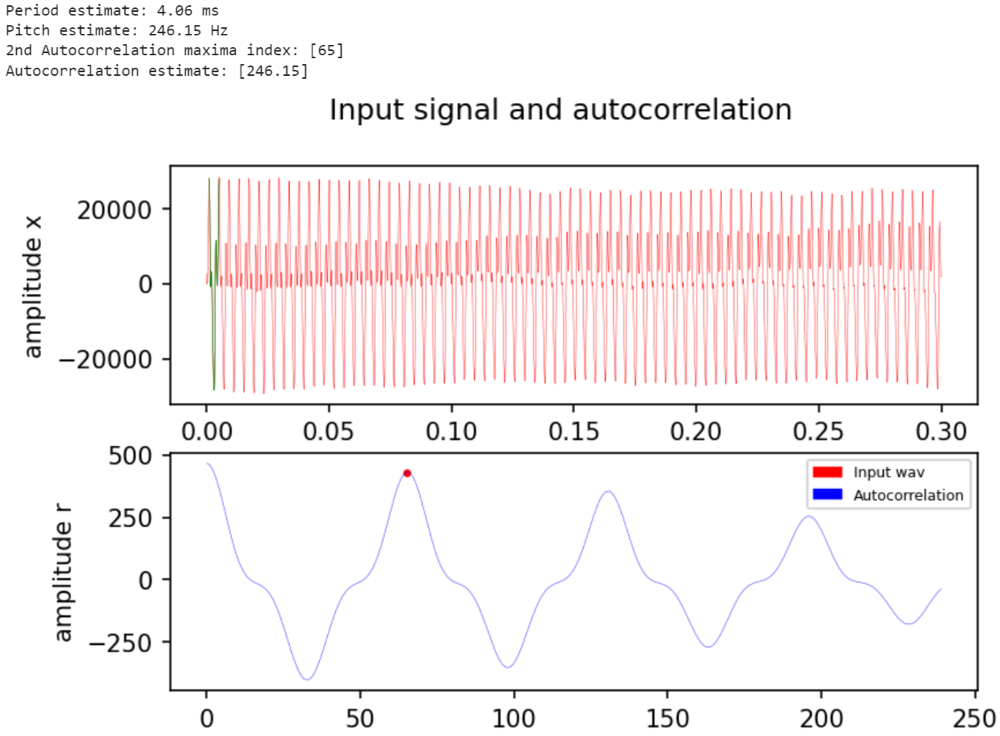
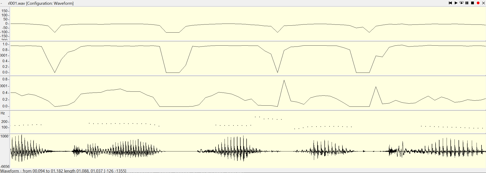
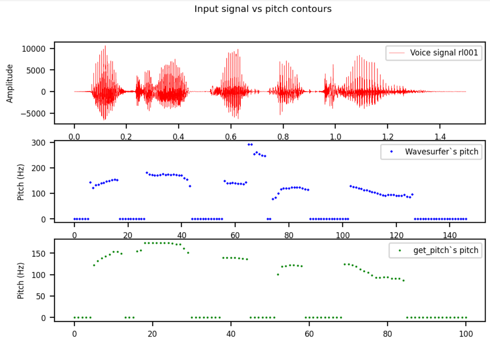
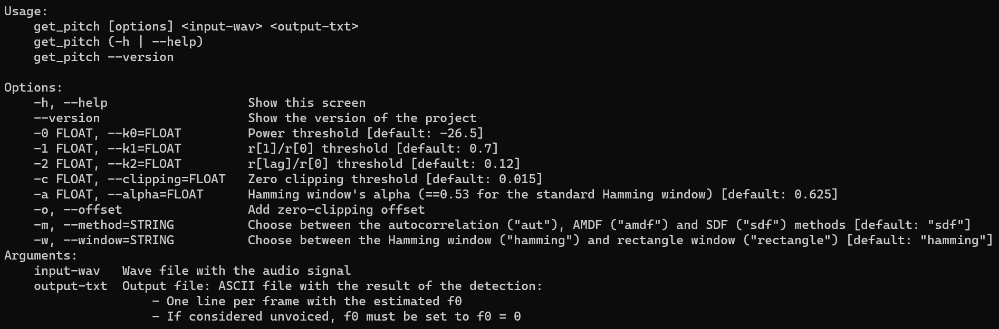
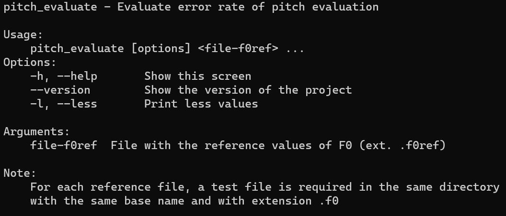
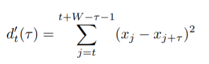
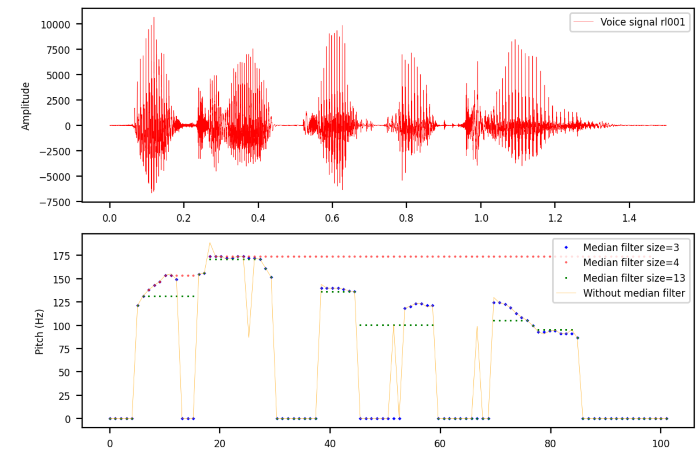

PAV - P3: detección de pitch
============================

Esta práctica se distribuye a través del repositorio GitHub [Práctica 3](https://github.com/albino-pav/P3).
Siga las instrucciones de la [Práctica 2](https://github.com/albino-pav/P2) para realizar un `fork` de la
misma y distribuir copias locales (*clones*) del mismo a los distintos integrantes del grupo de prácticas.

Recuerde realizar el *pull request* al repositorio original una vez completada la práctica.

Ejercicios básicos
------------------

- Complete el código de los ficheros necesarios para realizar la detección de pitch usando el programa
  `get_pitch`.

   * Complete el cálculo de la autocorrelación e inserte a continuación el código correspondiente.

   * Inserte una gŕafica donde, en un *subplot*, se vea con claridad la señal temporal de un segmento de
     unos 30 ms de un fonema sonoro y su periodo de pitch; y, en otro *subplot*, se vea con claridad la
	 autocorrelación de la señal y la posición del primer máximo secundario.

	 NOTA: es más que probable que tenga que usar Python, Octave/MATLAB u otro programa semejante para
	 hacerlo. Se valorará la utilización de la librería matplotlib de Python.

   La autocorrelación nos queda de la forma siguiente:

   <p align="center">
   
   </p>

  Como en el programa en C++, el segundo máximo de la autocorrelación lo encontramos buscando un máximo en un rango de valores determinados, lo cual independientemente de el número de ventana `window_number` que escojamos, suele funcionar bastante bien.
  Para encontrar el período de la gráfica, lo hemos programado buscando picos en el tiempo. Este método no es muy fiable, ya que a la mínima que tuvieramos distorsión la gráfica en tiempo oscilaría. Además, se hace una suposición que no siempre se cumple (el primer pico máximo será realmente el máximo de un periodo):

  ```py
  peaks = sig.find_peaks(data_in)
  peaks = peaks[0] #!!! highly unreliable, we can't guarantee that the first peak is a maxima
  first_peak = peaks[0] 
  #find second peak (90% of the maxima)
  max = data_in[first_peak]
  for i in range(len(peaks)-1):
    if((data_in[peaks[i+1]])> max*0.9):
      second_peak = peaks[i+1]
      break
  period = (second_peak-first_peak)/fm*1000
  ```
  El resto del código se encuentra en `plt_aut.py`
  Podemos ver como el método de búsqueda en el tiempo falla si cogemos un trozo específico de la gráfica (`first_sample_in = 1100`,
  `last_sample_in = 1700`):

   <p align="center">
   
   </p>

  Aunque es posible hacer métodos más sofisticados para encontrar el período directamente en el señal temporal, vemos que implementaciones simples como la nuestra fallan debido a las peculiaridades de los sonidos (no es una sinusoide ideal), las cuales se suelen tratar correctamente usando la autocorrelación o AMDF.

   * Determine el mejor candidato para el periodo de pitch localizando el primer máximo secundario de la
     autocorrelación. Inserte a continuación el código correspondiente.

  El código utilizado es:

  ```cpp
  for (iR = r.begin() + npitch_min; iR < r.begin() + npitch_max; iR++)
  {
    if (*iR > *iRMax)
    {
      iRMax = iR;
    }
  }
  ```

   * Implemente la regla de decisión sonoro o sordo e inserte el código correspondiente.
  
  Una primera regla de decisión ha sido usar un umbral para r[1]/r[0]:
   
  ```cpp
    if(r1norm<k1)
    return true;
  else
    return false;
  ```

  Como en la práctica anterior, el valor óptimo de k1 lo hemos calculado usando un bucle con un script de shell. Para ello también hemos modificado `pitch_evaluate.cpp` y los docopts de ambos programas.

- Una vez completados los puntos anteriores, dispondrá de una primera versión del detector de pitch. El 
  resto del trabajo consiste, básicamente, en obtener las mejores prestaciones posibles con él.

  * Utilice el programa `wavesurfer` para analizar las condiciones apropiadas para determinar si un
    segmento es sonoro o sordo. 
	
	  - Inserte una gráfica con la detección de pitch incorporada a `wavesurfer` y, junto a ella, los 
	    principales candidatos para determinar la sonoridad de la voz: el nivel de potencia de la señal
		(r[0]), la autocorrelación normalizada de uno (r1norm = r[1] / r[0]) y el valor de la
		autocorrelación en su máximo secundario (rmaxnorm = r[lag] / r[0]).

		Puede considerar, también, la conveniencia de usar la tasa de cruces por cero.

	    Recuerde configurar los paneles de datos para que el desplazamiento de ventana sea el adecuado, que
		en esta práctica es de 15 ms.

     Si calculamos la potencia, autocorrelación de uno y autocorrelación del máximo secundario obtenemos:
    <p align="center">
    
    </p>
   
    *Potencia, r[1]/r[0], r[1]/rmax, pitch detectado por wavesurfer y señal de rl001*

    Vemos que tanto `r[1]/r[0]` como `r[1]/rmax` son buenos indicadores para detectar un sonido sonoro. Aún así, `r[1]/rmax` se dispara en silencios largos, ya que el tramo de silencio empieza a estabilizar. De todos modos, la potencia permanece en niveles bajos cuando eso pasa, así que se podría usar su valor en el caso que este umbral se dispare.
    A partir de la gráfica podemos definir unos primeros umbrales `pot=-20`, `r[1]/r[0]=0.8` y `r[1]/r[0]=0.2`.

      - Use el detector de pitch implementado en el programa `wavesurfer` en una señal de prueba y compare
	    su resultado con el obtenido por la mejor versión de su propio sistema.  Inserte una gráfica
		ilustrativa del resultado de ambos detectores.
  
  * Optimice los parámetros de su sistema de detección de pitch e inserte una tabla con las tasas de error
    y el *score* TOTAL proporcionados por `pitch_evaluate` en la evaluación de la base de datos 
	`pitch_db/train`..

  Para la optimización, hemos usado el siguiente script:

  ```bash
  GETF0="get_pitch"
  EVAL="pitch_evaluate"

  lower_index_bound=80                    #lower bound of the for loop
  upper_index_bound=100                   #upper bound of the for loop
  offset=0                                #offset of the variable we want to iterate
  div=100                                 #controls the step size of the variable when we iterate it (=2 -> /2)
  for index in $(seq $lower_index_bound $upper_index_bound); do #vary $index from (lower_index_bound) to (upper_index_bound)
    k0=$(bc <<<"scale=5; $offset+$index/$div")    #stores offset+$index/div in k0 (uses basic calculator (bc) since shell doesn't seem to support floating point by default)
    for fwav in pitch_db/train/*.wav; do
     ff0=${fwav/.wav/.f0}
    $GETF0 $fwav $ff0 -0 $k0> /dev/null || (echo "Error in $GETF0 $fwav $ff0"; exit 1)
    done
    res=`$EVAL -l pitch_db/train/*f0ref || (echo "Error in $GETF0 $fwav $ff0"; exit 1)`
    echo "$k0 $res"
  done
  ```
  Como la última vez, simplemente itera sobre el script ya hecho `run_get_pitch`, y esto lo hace variando `k0` según queramos. En este caso está modificando la variable `k0` (`-0`). Para obtener los resultados en un fichero de texto, solo hemos de añadir `>nombre_out.txt` al final del comando cuando llamamos al script. Como `pitch_evaluate` está modificado de tal manera que solo imprima el total al usar `-l`, en nuestro fichero de salida nos quedará una primera columna con los valores de `k0` y una segunda con los resultados correspondientes a ese valor.
  Adicionalmente, también hemos creado un script similar a este, el cual itera de la misma manera solo que con más de un parámetro a partir de `fors` anidados (`opt_thresh.sh`). En particular, hemos usado este script principalmente para encontrar los umbrales que nos permitían ver si era un tramo sordo o sonoro, y el primero para optimizar individualmente los nuevos parámetros que ibamos añadiendo (longitud filtro mediana, umbral zero-clipping,..)

   * Inserte una gráfica en la que se vea con claridad el resultado de su detector de pitch junto al del
     detector de Wavesurfer. Aunque puede usarse Wavesurfer para obtener la representación, se valorará
	 el uso de alternativas de mayor calidad (particularmente Python).
   
   Nos queda lo siguiente:

    <p align="center">
    
    </p>
   

Ejercicios de ampliación
------------------------

- Usando la librería `docopt_cpp`, modifique el fichero `get_pitch.cpp` para incorporar los parámetros del
  detector a los argumentos de la línea de comandos.
  
  Esta técnica le resultará especialmente útil para optimizar los parámetros del detector. Recuerde que
  una parte importante de la evaluación recaerá en el resultado obtenido en la detección de pitch en la
  base de datos.

  * Inserte un *pantallazo* en el que se vea el mensaje de ayuda del programa y un ejemplo de utilización
    con los argumentos añadidos.

Por un lado, en el programa principal `get_pitch` hemos añadido lo siguiente:

<p align="center">
   
</p>

Además, para faciltar la lectura y guardado en los valores generados con nuestro script de shell `opt_get_pitch`, hemos añadido la opción `-l` en `pitch_evaluate`, la cual solo imprime el resultado final del resumen:

<p align="center">
   
</p>

- Implemente las técnicas que considere oportunas para optimizar las prestaciones del sistema de detección
  de pitch.

  Entre las posibles mejoras, puede escoger una o más de las siguientes:

  * Técnicas de preprocesado: filtrado paso bajo, *center clipping*, etc.
  * Técnicas de postprocesado: filtro de mediana, *dynamic time warping*, etc.
  * Métodos alternativos a la autocorrelación: procesado cepstral, *average magnitude difference function*
    (AMDF), etc.
  * Optimización **demostrable** de los parámetros que gobiernan el detector, en concreto, de los que
    gobiernan la decisión sonoro/sordo.
  * Cualquier otra técnica que se le pueda ocurrir o encuentre en la literatura.

  Encontrará más información acerca de estas técnicas en las [Transparencias del Curso](https://atenea.upc.edu/pluginfile.php/2908770/mod_resource/content/3/2b_PS%20Techniques.pdf)
  y en [Spoken Language Processing](https://discovery.upc.edu/iii/encore/record/C__Rb1233593?lang=cat).
  También encontrará más información en los anexos del enunciado de esta práctica.

  Incluya, a continuación, una explicación de las técnicas incorporadas al detector. Se valorará la
  inclusión de gráficas, tablas, código o cualquier otra cosa que ayude a comprender el trabajo realizado.

  También se valorará la realización de un estudio de los parámetros involucrados. Por ejemplo, si se opta
  por implementar el filtro de mediana, se valorará el análisis de los resultados obtenidos en función de
  la longitud del filtro.
   
En primer lugar, antes de obtener el pitch se hace un pre-procesado del tipo *central-clipping*. Para ello, por defecto se usa el *central-clipping sin offset*, el cual pone a 0 los valores de `x` que cumplan `-clipping_thresh`< `x` <`clipping_thresh`. También se ha implementado la versión con offset, aunque esta no ha sido tan útil de cara a nuestro detector, ya que posiblemente el hecho de desplazar muestras hacia 0 ha añadido cierto ruido a la hora de tratar con la señal. Aún así, se puede añadir el offset si llamamos a `get_pitch` con la opción `-o`.

```cpp
for (unsigned int i = 0; i < x.size(); i++)
{
  if (abs(x[i]) < clipping_thr)
    x[i] = 0;
  else if (offset)
  {
    if (x[i] > 0) //add offset if -o == TRUE
      x[i] = x[i] - clipping_thr;
    else
      x[i] = x[i] + clipping_thr;
  }
}
```

Hecho esto, se segmenta la señal en ventanas y se empieza a calcular la frecuencia fundamental con el método **Squared difference function** [**(SDF, tipo II)**](http://www.cs.otago.ac.nz/tartini/papers/A_Smarter_Way_to_Find_Pitch.pdf), el cual es una variante de AMDF el cual eleva al cuadrado las diferencias, lo cual le añade robustez frente el ruido:

<p align="center">
   
</p>

Este nos ha proporcionado mejores resultados que usando el AMDF, aunque perdemos parte del motivo por el cual se usa el AMDF: el coste computacional es mayor, ya se usan multiplicaciones al elevarlo al cuadrado. Además, debido a este cuadrado, tenemos la autocorrelación directamente implícita en uno de los términos (-2r[k]) si lo desarrollamos. Para los umbrales de sordo o sonoro, hemos seguido usando los datos que se usaban para la autocorrelación (`pot`,`r1norm` y `rmaxnorm`)
El código más relevante es el siguiente:

```cpp
float min = -1;
int lag = npitch_min;
float m_k, r_k;
  for (unsigned int k = npitch_min; k < npitch_max; k++)
  {
  a[k] = 0;
  for (unsigned int n = 0; n < x.size() - k - 1; n++)
  {
    if (a[k] > min && min != -1)  //quit loop if it's bigger than the current minima and minima has been set
      continue;
    //ASMDF is the squared AMDF
    //a[k] += (x[n] - x[n + k]) * (x[n] - x[n + k]) =  x[n] * x[n] + x[n + k] * x[n + k] -2*(x[n] * x[n + k]) = m_k -2r_k
    m_k = x[n] * x[n] + x[n + k] * x[n + k];
    r_k = x[n] * x[n + k];
    a[k] += m_k - 2 * r_k;
  }

  if (min == -1)
  {
    min = a[k];
  }
  else if (min > a[k])
  {
    min = a[k];
    lag = k;
  }
}
```
  Una ventaja que ha conservado del AMDF es que al ser un mínimo podemos salir del bucle una vez este se excede, ahorrándonos algunas operaciones.

  Por último, se hace un post-procesado del vector con las frecuencias fundamentales de salida con un filtro de mediana con longitud 3. Este consiste en una ventana deslizante (`f0temp`) que calcula la mediana en cada posición y la sustituye al valor previo de `f0` para poder así eliminar pequeñas irregularidades:

  ```cpp
  int med_window = 3;
  int half_window = round(med_window / 2);
  for (unsigned int i = half_window; i < (f0.size() - half_window); i++)
  {
    for (int j = 0; j < med_window * 2; j++)
    {
      f0temp.push_back(f0[j + i - half_window]);
    }
    //sort values and pick the middle one
    sort(f0temp.begin(), f0temp.begin() + med_window);
    f0[i] = f0temp[round(med_window / 2)];
    f0temp.clear();
  }
  ```
  A continuación se puede ver como varía nuestro output según el filtro de mediana aplicado:
  
<p align="center">
   
</p>

  Como se puede ver, el que nos proporciona una detección más razonable se obtiene si `window_size=3`. Por un lado, nos ayuda a eliminar irregularidades molestas que encontramos de no aplicarlo. Por otro lado, es lo suficientemente pequeño para no propagar demasiado error, lo cual ocurre a medida que utilizamos ventanas más grandes. Algo a tener en cuenta es que tomar valores pares causa confusión a la hora de encontrar el valor central de nuestro filtro, cosa que genera bastante error.

Evaluación *ciega* del detector
-------------------------------

Antes de realizar el *pull request* debe asegurarse de que su repositorio contiene los ficheros necesarios
para compilar los programas correctamente ejecutando `make release`.

Con los ejecutables construidos de esta manera, los profesores de la asignatura procederán a evaluar el
detector con la parte de test de la base de datos (desconocida para los alumnos). Una parte importante de
la nota de la práctica recaerá en el resultado de esta evaluación.
