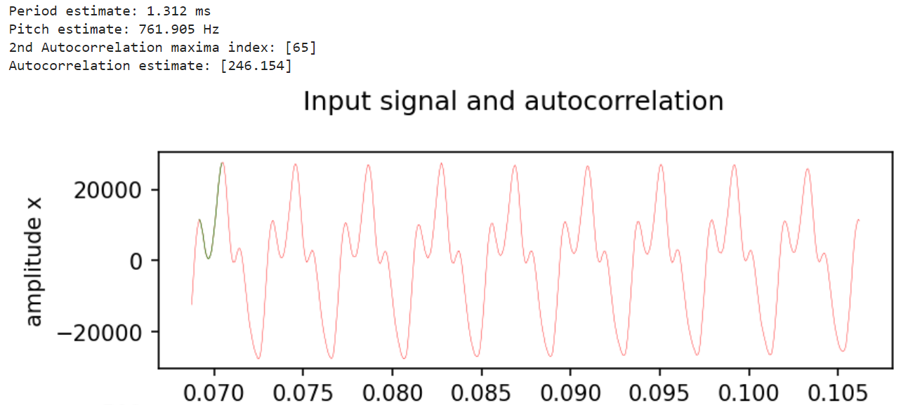
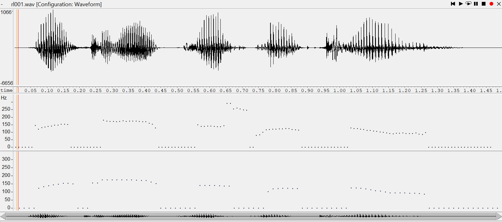
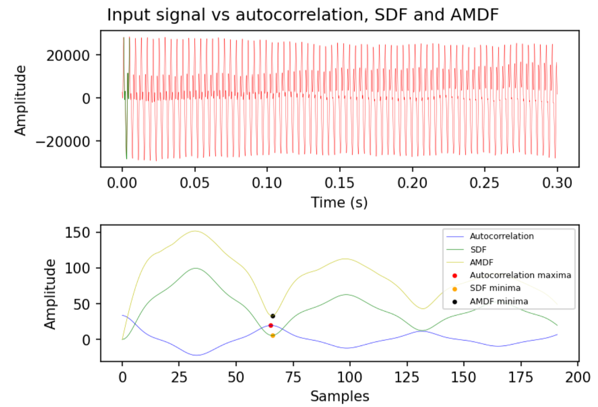
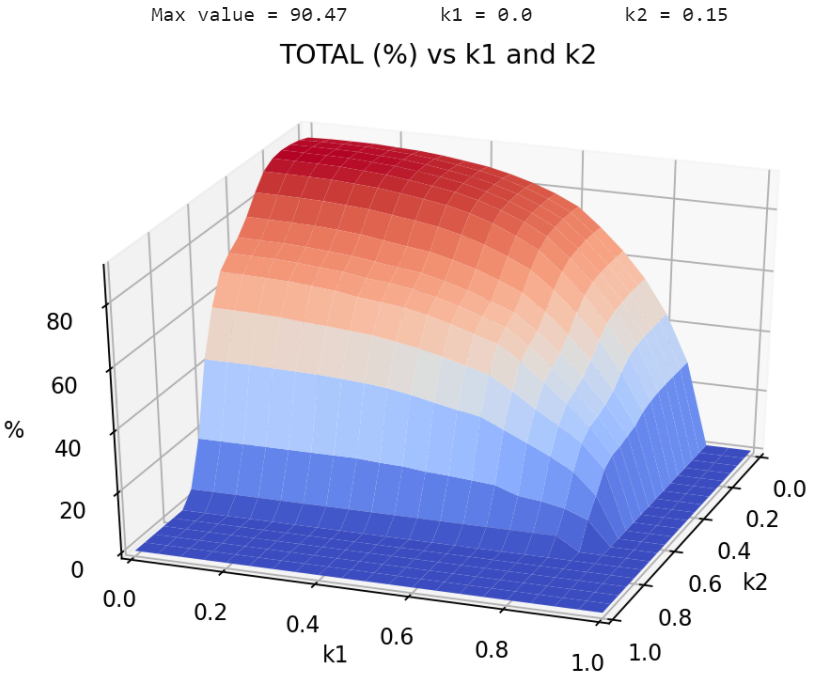
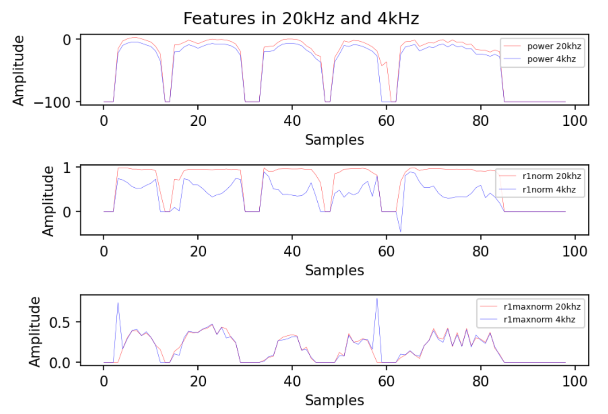
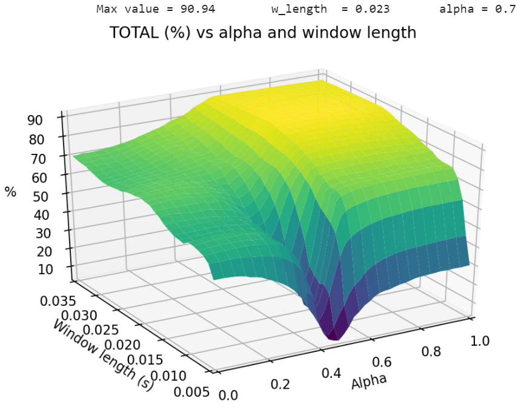
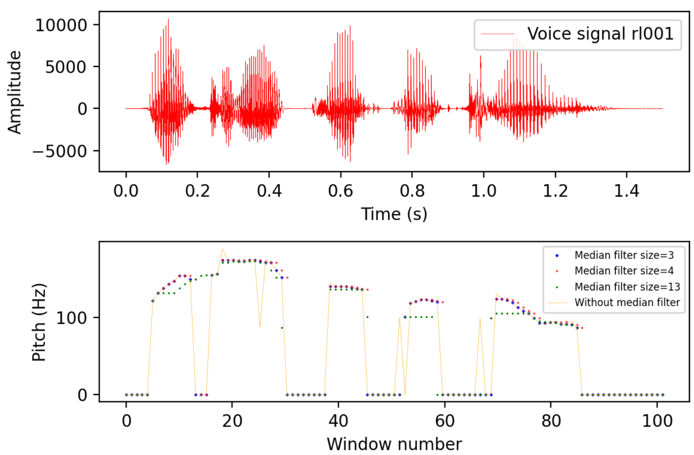

# PAV - P3: detección de pitch

Esta práctica se distribuye a través del repositorio GitHub [Práctica 3](https://github.com/albino-pav/P3).
Siga las instrucciones de la [Práctica 2](https://github.com/albino-pav/P2) para realizar un `fork` de la
misma y distribuir copias locales (_clones_) del mismo a los distintos integrantes del grupo de prácticas.

Recuerde realizar el _pull request_ al repositorio original una vez completada la práctica.

## Ejercicios básicos

- Complete el código de los ficheros necesarios para realizar la detección de pitch usando el programa
  `get_pitch`.

  - Complete el cálculo de la autocorrelación e inserte a continuación el código correspondiente.

    El código para el cálculo de la autocorrelación es:

```cpp
  for (unsigned int l = 0; l < r.size(); ++l)
  {
    //Quit loop if amdf has been selected and r[0] and r[1] have been computed
    if ((method == PitchAnalyzer::SDF || method == PitchAnalyzer::AMDF) && (l > 1))
      break;
    /// \TODO Compute the autocorrelation r[l]
    /// \DONE Autocorrelation *computed*

    r[l] = 0;
    for (unsigned int n = l; n < x.size(); n++)
    {
      r[l] += x[n] * x[n - l];
    }
  }

  if (r[0] == 0.0F) //to avoid log() and divide zero
    r[0] = 1e-10;
```

- Inserte una gŕafica donde, en un _subplot_, se vea con claridad la señal temporal de un segmento de
  unos 30 ms de un fonema sonoro y su periodo de pitch; y, en otro _subplot_, se vea con claridad la
  autocorrelación de la señal y la posición del primer máximo secundario.

  NOTA: es más que probable que tenga que usar Python, Octave/MATLAB u otro programa semejante para
  hacerlo. Se valorará la utilización de la librería matplotlib de Python.

Usando python, vemos que la autocorrelación nos queda de la forma siguiente:

   <p align="center">
   
   </p>

Como en el programa en C++, el segundo máximo de la autocorrelación lo encontramos buscando un máximo en un rango de valores determinados(`lowest_pitch_samples:highest_pitch_samples`). Este método, independientemente del número de ventana `window_number` que escojamos, suele funcionar bastante bien.

Para encontrar el periodo de la gráfica, lo hemos programado buscando picos en el tiempo. Este método no es muy fiable, ya que a la mínima que tuvieramos distorsión la gráfica en tiempo oscilaría y sería más complicado encontrarlos sin tratar con la señal primero. Además, se hace una suposición que no siempre se cumple (el primer pico encontrado será realmente el máximo de un periodo):

```py
peaks = sig.find_peaks(data_in)
peaks = peaks[0] #!!! highly unreliable, we can't guarantee that the first peak is a maxima
first_peak = peaks[0]
#find second peak (90% of the maxima)
max = data_in[first_peak]
for i in range(len(peaks)-1):
  if((data_in[peaks[i+1]])> max*0.9):
    second_peak = peaks[i+1]
    break
period = (second_peak-first_peak)/fm*1000
```

El resto del código se encuentra en `plt_aut.py`

Podemos ver como el método de búsqueda en el tiempo falla si cogemos otro trozo específico de la gráfica (`first_sample_in = 1100`,
`last_sample_in = 1700`):

   <p align="center">
   
   </p>

Aunque es posible hacer métodos más sofisticados para encontrar el período directamente en el señal temporal, vemos que implementaciones simples como la nuestra fallan rápidamente debido a las peculiaridades de los sonidos (no es una sinusoide ideal), las cuales se suelen mejor usando la autocorrelación o AMDF.

- Determine el mejor candidato para el periodo de pitch localizando el primer máximo secundario de la
  autocorrelación. Inserte a continuación el código correspondiente.

El código utilizado es:

```cpp
for (iR = r.begin() + npitch_min; iR < r.begin() + npitch_max; iR++)
{
  if (*iR > *iRMax)
  {
    iRMax = iR;
  }
}
```

- Implemente la regla de decisión sonoro o sordo e inserte el código correspondiente.

Una primera regla de decisión ha sido usar un umbral para r[1]/r[0]:

```cpp
  if(r1norm<k1)
  return true;
else
  return false;
```

Como en la práctica anterior, el valor óptimo de `k1` lo hemos calculado usando un bucle con un script de shell. Para ello también hemos modificado `pitch_evaluate.cpp` y los docopts de ambos programas. Además, nuestra regla de decisión final incluye  otros parámetros como `rmaxnorm` y `pot`, los cuales hemos optimizado de la misma manera [(explicación detallada aquí)](###optimización-de-parámetros):

```cpp
  if (((rmaxnorm < k2 || r1norm < k1 || pot < k0))) 
    return true;
  else
    return false;
```

- Una vez completados los puntos anteriores, dispondrá de una primera versión del detector de pitch. El
  resto del trabajo consiste, básicamente, en obtener las mejores prestaciones posibles con él.

  - Utilice el programa `wavesurfer` para analizar las condiciones apropiadas para determinar si un
    segmento es sonoro o sordo.

    - Inserte una gráfica con la detección de pitch incorporada a `wavesurfer` y, junto a ella, los
      principales candidatos para determinar la sonoridad de la voz: el nivel de potencia de la señal
      (r[0]), la autocorrelación normalizada de uno (r1norm = r[1] / r[0]) y el valor de la
      autocorrelación en su máximo secundario (rmaxnorm = r[lag] / r[0]).

    Puede considerar, también, la conveniencia de usar la tasa de cruces por cero.

    Recuerde configurar los paneles de datos para que el desplazamiento de ventana sea el adecuado, que
    en esta práctica es de 15 ms.

    Si calculamos la potencia, autocorrelación de uno y autocorrelación del máximo secundario obtenemos:
    <p align="center">
    
    </p>

    _Potencia, r1norm, rmaxnorm, pitch detectado por wavesurfer y señal de rl001_

    Vemos que tanto `r1norm` como `rmaxnorm` son buenos indicadores para detectar un sonido sonoro. Aún así, `rmaxnorm` se dispara en silencios largos, ya que el tramo de silencio empieza a estabilizar. De todos modos, la potencia permanece en niveles bajos cuando eso pasa, así que se podría usar su valor en el caso que este umbral se dispare.
    A partir de la gráfica podemos definir unos primeros umbrales `pot=-20`, `r[1]/r[0]=0.8` y `r[1]/r[0]=0.2`.

    - Use el detector de pitch implementado en el programa `wavesurfer` en una señal de prueba y compare
      su resultado con el obtenido por la mejor versión de su propio sistema. Inserte una gráfica
      ilustrativa del resultado de ambos detectores.

    La gráfica que obtenemos con wavesurfer es la siguiente:

    <p align="center">
    
    </p>
    
    *Señal de voz rl001.wav, pitch detectado por Wavesurfer, pitch detectado por nuestro programa*

    Nuestros resultados son más promediados que los obtenidos con Wavesurfer, aunque también, nuestro sistema tiende más a marcar las tramas como sordas.

  - Optimice los parámetros de su sistema de detección de pitch e inserte una tabla con las tasas de error
    y el _score_ TOTAL proporcionados por `pitch_evaluate` en la evaluación de la base de datos
    `pitch_db/train`..

  Para la optimización, hemos usado el siguiente script:

  ```bash
  GETF0="get_pitch"
  EVAL="pitch_evaluate"

  lower_index_bound=80                    #lower bound of the for loop
  upper_index_bound=100                   #upper bound of the for loop
  offset=0                                #offset of the variable we want to iterate
  div=100                                 #controls the step size of the variable when we iterate it (=2 -> /2)
  for index in $(seq $lower_index_bound $upper_index_bound); do #vary $index from (lower_index_bound) to (upper_index_bound)
    k0=$(bc <<<"scale=5; $offset+$index/$div")    #stores offset+$index/div in k0 (uses basic calculator (bc) since shell doesn't seem to support floating point by default)
    for fwav in pitch_db/train/*.wav; do
     ff0=${fwav/.wav/.f0}
    $GETF0 $fwav $ff0 -0 $k0> /dev/null || (echo "Error in $GETF0 $fwav $ff0"; exit 1)
    done
    res=`$EVAL -l pitch_db/train/*f0ref || (echo "Error in $GETF0 $fwav $ff0"; exit 1)`
    echo "$k0 $res"
  done
  ```

  Como la última vez, simplemente itera sobre el script ya hecho `run_get_pitch`, y esto lo hace variando `k0` según queramos. En este caso está modificando la variable `k0` (`-0`). Para obtener los resultados en un fichero de texto, solo hemos de añadir `>nombre_out.txt` al final del comando cuando llamamos al script. Como `pitch_evaluate` está modificado de tal manera que solo imprima el total al usar `-l`, buestro fichero de salida solo tendrá una primera columna con los valores de `k0` y una segunda con los resultados correspondientes a ese valor.
  Adicionalmente, también hemos creado un script similar a este, el cual itera de la misma manera solo que con más de un parámetro a partir de `fors` anidados (`opt_thresh.sh`). En particular, hemos usado este segundo script principalmente para encontrar los umbrales que nos permitían ver si era un tramo sordo o sonoro, y el primero para optimizar individualmente los nuevos parámetros que ibamos añadiendo (longitud filtro mediana, umbral zero-clipping,..)

  Los resultados finales obtenidos son:

  **### Summary**
  **_Num.frames:_** |**_Unvoiced frames as voiced:_** |**_Voiced frames as unvoiced:_** |**_Gross voiced errors:_**|**_MSE of fine errors:_**
  -------------------------| :-----------------------: |:---------------------------:| :----------------------:| :----------------------:
  _8455 (5376 unvoiced+ 3079 voiced)_|_238/5376 (4.43 %)_|_205/3079 (6.66 %)_ |_72/2874 (2.51 %)_ | _3.09 %_  
  **_TOTAL: 90.96%_**

  - Inserte una gráfica en la que se vea con claridad el resultado de su detector de pitch junto al del
    detector de Wavesurfer. Aunque puede usarse Wavesurfer para obtener la representación, se valorará
    el uso de alternativas de mayor calidad (particularmente Python).

  Nos queda lo siguiente:

    <p align="center">
    
    </p>
  
  *Script `plot_pitch.py`*

## Ejercicios de ampliación

- Usando la librería `docopt_cpp`, modifique el fichero `get_pitch.cpp` para incorporar los parámetros del
  detector a los argumentos de la línea de comandos.

  Esta técnica le resultará especialmente útil para optimizar los parámetros del detector. Recuerde que
  una parte importante de la evaluación recaerá en el resultado obtenido en la detección de pitch en la
  base de datos.

  - Inserte un _pantallazo_ en el que se vea el mensaje de ayuda del programa y un ejemplo de utilización
    con los argumentos añadidos.

Por un lado, en el programa principal `get_pitch` hemos añadido lo siguiente:

<p align="center">
   
</p>

Un ejemplo para obtener el pitch de un fichero llamado rl001.wav usando la autocorrelación, ventana rectangular y umbral de potencia -20 dB sería:
```bash
   get_pitch rl001.wav rl001.f0 -m aut -w rectangle -0 -20
```
Además, para faciltar la lectura y guardado en los valores generados con nuestro script de shell `opt_get_pitch`, hemos añadido la opción `-l` en `pitch_evaluate`, la cual solo imprime el resultado final del resumen:

<p align="center">
   
</p>

- Implemente las técnicas que considere oportunas para optimizar las prestaciones del sistema de detección
  de pitch.

  Entre las posibles mejoras, puede escoger una o más de las siguientes:

  - Técnicas de preprocesado: filtrado paso bajo, _center clipping_, etc.
  - Técnicas de postprocesado: filtro de mediana, _dynamic time warping_, etc.
  - Métodos alternativos a la autocorrelación: procesado cepstral, _average magnitude difference function_
    (AMDF), etc.
  - Optimización **demostrable** de los parámetros que gobiernan el detector, en concreto, de los que
    gobiernan la decisión sonoro/sordo.
  - Cualquier otra técnica que se le pueda ocurrir o encuentre en la literatura.

  Encontrará más información acerca de estas técnicas en las [Transparencias del Curso](https://atenea.upc.edu/pluginfile.php/2908770/mod_resource/content/3/2b_PS%20Techniques.pdf)
  y en [Spoken Language Processing](https://discovery.upc.edu/iii/encore/record/C__Rb1233593?lang=cat).
  También encontrará más información en los anexos del enunciado de esta práctica.

  Incluya, a continuación, una explicación de las técnicas incorporadas al detector. Se valorará la
  inclusión de gráficas, tablas, código o cualquier otra cosa que ayude a comprender el trabajo realizado.

  También se valorará la realización de un estudio de los parámetros involucrados. Por ejemplo, si se opta
  por implementar el filtro de mediana, se valorará el análisis de los resultados obtenidos en función de
  la longitud del filtro.

### Pre-procesado
En primer lugar, antes de obtener el pitch se hace un pre-procesado del tipo _central-clipping_.
Para ello, por defecto usamos _central-clipping sin offset_, el cual pone a 0 los valores de `x` que cumplan `-clipping_thresh`< `x` <`clipping_thresh`. También se ha implementado la versión con offset, aunque esta no ha sido tan útil de cara a nuestro detector, ya que posiblemente el hecho de desplazar muestras hacia 0 ha añadido cierto ruido/ambigüedad a la hora de tratar con la señal. Aún así, se puede añadir el offset si llamamos a `get_pitch` con la opción `-o`.

```cpp
for (unsigned int i = 0; i < x.size(); i++)
{
  if (abs(x[i]) < clipping_thr)
    x[i] = 0;
  else if (offset)
  {
    if (x[i] > 0) //add offset if -o == TRUE
      x[i] = x[i] - clipping_thr;
    else
      x[i] = x[i] + clipping_thr;
  }
}
```
### AMDF y SDF
Hecho el pre-procesado, se segmenta la señal en ventanas y se empieza a calcular la frecuencia fundamental con el método **Squared difference function** [**(SDF, tipo II)**](http://www.cs.otago.ac.nz/tartini/papers/A_Smarter_Way_to_Find_Pitch.pdf), el cual es una variante de AMDF que eleva al cuadrado las diferencias, lo cual añade cierta robustez frente el ruido:

<p align="center">
   
</p>

Este nos ha proporcionado mejores resultados que usando el AMDF, aunque perdemos parte del motivo por el cual lo usábamos: el coste computacional es mayor, ya se usan multiplicaciones al elevarlo al cuadrado. Debido a este cuadrado, tenemos la autocorrelación directamente implícita en uno de los términos (`-2r[k]`) si lo desarrollamos.

Para los umbrales de sordo o sonoro, hemos seguido usando los datos que se usaban para la autocorrelación (`pot`,`r1norm` y `rmaxnorm`)
El código más relevante es el siguiente:

```cpp
vector<float> a(npitch_max);
float min = -1;
int lag = npitch_min;
float m_k, r_k;
for (unsigned int k = npitch_min; k < npitch_max; k++)
{
  a[k] = 0;
  for (unsigned int n = 0; n < x.size() - k - 1; n++)
  {
    if (a[k] > min && min != -1) //quit loop if it's bigger than the current minima and minima has been set
      continue;

    if (method == PitchAnalyzer::AMDF)
      a[k] += abs(x[n] - x[n + k]);
    else
    {
      //SDF is the squared AMDF
       //a[k] += (x[n] - x[n + k]) * (x[n] - x[n + k]) =  x[n] * x[n] + x[n + k] * x[n + k] -2*(x[n] * x[n + k]) = m_k -2r_k
      m_k = x[n] * x[n] + x[n + k] * x[n + k];
      r_k = x[n] * x[n + k];
      a[k] += m_k - 2 * r_k;
    }
  }
  if (min == -1)
  {
    min = a[k];
  }
  else if (min > a[k])
  {
    min = a[k];
    lag = k;
  }
}
```

Una ventaja que ha conservado del AMDF es que al ser un mínimo podemos salir del bucle una vez este se excede, ahorrándonos algunas operaciones.

Las diferentes funciones disponibles en el programa para el cálculo de pitch tienen esta forma:

<p align="center">



  ***Method*** |***n obtained (samples)*** |***Pitch estimate (Hz)*** 
  :-----------:| :-----------------: |:------------------------:
  *Period*     |65                   |246.154 
  *Autocorrelation*|65               |246.154 
  *AMDF*       |66                   |242.424
  *SDF*        |66                   |242.424 

</p>

Como se ha mencionado previamente, uno de los elementos distintivos entre la autocorrelación y AMDF y similares es el hecho de que se busquen mínimos en vez de máximos, lo cual nos ahorra calcular todo el rango de valores superiores al mínimo actual. En la gráfica también se puede ver como los mínimos del SDF son más prominentes que los del AMDF, ya que al elevar al cuadrado accentuamos los picos y reducimos los valles.

### Optimización de parámetros

Para perder menos tiempo esperando a que se ejecutara, en primer lugar hemos creado un nuevo banco de voz muestreado a 4kHz (`sox_resample.sh`), el cual nos ha dado margen para poder probar más estrategias y tener una idea de los umbrales óptimos rápidamente.

Los parámetros a ajustar principales usando estos nuevos audios han sido el umbral de la potencia `pot`, r[1] normalizada `r1norm` y r[max] normalizada `rmaxnorm`. Hicimos un primer barrido donde la potencia iba desde -29 hasta -1 en saltos de 1 dB y los otros dos umbrales iban hasta 1 en saltos de 0.05:

<p align="center">
       
</p>

*Código para las gráficas en `plot_opt_3D.py` y `plot_k0.py`* 

Este primer resultado se acercaba a los umbrales decididos 'a mano' de la potencia y la autocorrelación máxima normalizada, aunque la autocorrelación de 1 aparecía como si fuera mejor no considerarla. Es por ello que analizamos estos parámetros para compararlos con los que se obtenían a 20kHz y poder sacar conclusiones:

<p align="center">
   
</p>

A partir de esto se puede deducir que:
- El umbral con `rmaxnorm` será bastante parecido al que se obtiene con 4kHz, ya que al bajar la frecuencia de muestreo no varía mucho.
- El umbral de la potencia será unos 5-6 dB (diferencia entre gráficas) mayor cuando nuestro programa opere con el banco a 20kHz
- `r1norm` es demasiado diferente para tomar el umbral obtenido de referencia. 

Aunque no podemos descartar que la diferencia entre `r1norm` al usar diferentes frecuencias de muestreo se pueda deber a algun error de implementación, es posible que al quedarnos con 1 de cada 5 muestras al bajar la frecuencia de muestreo los resultados varíen bastante, ya que estamos comparando muestras algo más lejanas que antes.

Visto esto, para la implementación real tomamos los umbrales `pot=-23`, `r1norm=0.8` (valor observado en Wavesurfer), y `rmaxnorm=0.15`. Además, al ver que la potencia no variaba demasiado fijados los otros dos parámetros, hicimos un barrido de solo estos dos últimos y optimizamos la potencia de manera independiente. Como resultado nuestros umbrales finales han sido `pot=-26.5`, `r1norm=0.7` y `rmaxnorm=0.12`.

Otra optimización ha sido el tamaño de la ventana junto a la alpha de la ventana de Hamming, la cual determina como decaen los límites de esta (`alpha=1` es la ventana rectangular):

<p align="center">
   
</p>

Los valores óptimos los hemos obtenido cuando tenemos un tamaño de ventana de unos 23-25 ms y alpha está alrededor de 0.6-0.7. Se ha de decir, pero, que algunas de estas optimizaciones están demasiado referidas a nuestro banco de voz de entrenamiento en concreto y luego puede que al usar otro diferente se obtengan peores resultados, ya que quizás lo hemos particularizado demasiado.

El resto de parámetros usados han estado optimizados de forma independiente usando `opt_get_pitch`.

### Post-procesado

Por último, se hace un post-procesado del vector resultante `f0` con un filtro de mediana de longitud 3. Este consiste en una ventana deslizante (`f0temp`) que calcula la mediana en cada posición y la sustituye al valor previo de `f0` para poder así eliminar pequeñas irregularidades:

```cpp
  f0ref=f0;   //reference array, original values are stored here
  int med_window = 3;
  int half_window = round(med_window / 2);
  for (unsigned int i = half_window; i < (f0.size() - half_window); i++)
  {
    for (int j = 0; j < med_window * 2; j++)
    {
      f0temp.push_back(f0ref[j + i - half_window]);
    }
    //sort values and pick the middle one
    sort(f0temp.begin(), f0temp.begin() + med_window);
    f0[i] = f0temp[round(med_window / 2)];
    f0temp.clear();
  }
}
```

A continuación se puede ver como varía nuestro output según el filtro de mediana aplicado:

<p align="center">
   
</p>

Como se puede ver, el que nos proporciona una detección más razonable se obtiene si `window_size=3`. Este tamaño nos ayuda a eliminar irregularidades molestas que encontramos de no aplicarlo, y, a su vez, es lo suficientemente pequeño para no propagar demasiado error, lo cual ocurre a medida que aumentamos el tamaño de la ventana. Algo a tener en cuenta es que tomar valores pares como tamaño de ventana causa confusión a la hora de encontrar el valor central de nuestro filtro, cosa que a veces empeora los resultados:

## Evaluación _ciega_ del detector

Antes de realizar el _pull request_ debe asegurarse de que su repositorio contiene los ficheros necesarios
para compilar los programas correctamente ejecutando `make release`.

Con los ejecutables construidos de esta manera, los profesores de la asignatura procederán a evaluar el
detector con la parte de test de la base de datos (desconocida para los alumnos). Una parte importante de
la nota de la práctica recaerá en el resultado de esta evaluación.
